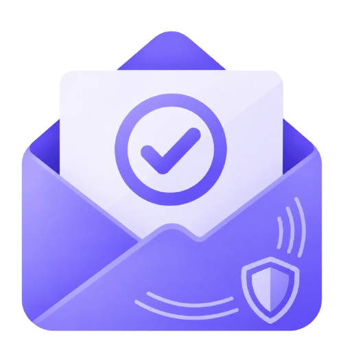

# TrueMail

**Email infrastructure you actually own — now with an AI agent powered by MCP.**

TrueMail is a self-hosted-friendly email client built on your own domain and your own [Resend](https://resend.com) account. It ships a full **Model Context Protocol (MCP) server** that exposes your inbox, tasks, promises, and calendar as tools — so an AI agent can search emails, summarise threads, create tasks, and send replies, all from a chat interface inside the app.

> Built for the [Amazon App Developer Hackathon 2026](https://amazonappdev2026.devpost.com) — Alexa+ / MCP track.

---

## What's new for the hackathon

| Feature | Detail |
|---|---|
| **Self-hosted MCP server** | Standalone Express server at `mcp/` with [Streamable HTTP transport](https://modelcontextprotocol.io/specification/2025-03-26/basic/transports#streamable-http) — stateless, one transport per POST, spec-compliant |
| **12 MCP tools** | `search_emails`, `get_email`, `summarize_email`, `extract_actions`, `send_email` *, `reply_email` *, `search_tasks`, `create_task`, `complete_task`, `search_promises`, `create_promise`, `search_calendar` |
| **Tomy Agent** | Chat UI at `/ai` backed by `/api/agent` — full agentic tool loop via MCP, powered by **NVIDIA NIM / Llama 3.2 11B** |
| **Gmail connector** | OAuth2 connect flow → syncs Gmail inbox into TrueMail as a separate mailbox; searchable by Tomy |
| **Confirmation before send** | `send_email` / `reply_email` return a preview and require `confirmed: true` — the agent asks before anything is sent |

\* Requires explicit confirmation in the chat before the email is sent.

---

## Features

- **Custom domain** — add a domain, verify SPF/DKIM/DMARC, send from an address that's yours
- **BYO Resend** — connect your Resend account via OAuth; credentials are encrypted at rest
- **Multiple mailboxes** — as many addresses as you need on one domain
- **Gmail connector** — connect your Google account to read Gmail emails inside TrueMail
- **Full inbox** — starred, important, archive, spam, trash, labels, search
- **Compose, reply, reply-all, forward** — with attachments via Cloudinary
- **Tasks** — due dates, priorities, lists, subtasks, recurring tasks with reminders
- **Calendar** — month view, national/regional holidays, tasks on their due date
- **Promises** — track commitments in both directions (you promised / someone promised you)
- **Overview dashboard** — unread counts, task snapshot, GitHub-style activity graph
- **Tomy AI** — chat agent that searches emails, creates tasks, tracks promises, reads your calendar, and can send email with your approval
- **Telegram assistant** — daily digests, task creation, and email summaries via Telegram bot
- **Dark mode**, hand-drawn UI ([Drawably](https://www.npmjs.com/package/drawably)), responsive down to phone width

---

## Architecture

```
Browser
  │
  ├── Next.js 16 app (web/)          ← main app, auth, DB, all UI
  │     ├── /api/agent               ← agentic chat endpoint
  │     ├── /api/emails/search       ← cross-mailbox search (used by MCP)
  │     └── ... all other API routes
  │
  └── MCP Server (mcp/)              ← separate Express process
        ├── POST /mcp                ← Streamable HTTP transport (stateless)
        └── 12 tools → call web/api/* with internal shared-secret auth
```

**Auth bridging:** The MCP server calls TrueMail's own API routes using two shared secrets:

- `INTERNAL_API_KEY` — MCP server → TrueMail (`x-internal-key` header)  
- `MCP_SHARED_SECRET` — Tomy agent → MCP server (`x-internal-secret` header)

Neither secret is ever exposed to the browser.

---

## Tech stack

| Layer | Technology |
|---|---|
| Framework | [Next.js 16](https://nextjs.org) (App Router, Turbopack) + React 19 + TypeScript |
| Database | [Prisma 7](https://www.prisma.io) on PostgreSQL ([Supabase](https://supabase.com)) |
| Auth | [better-auth](https://www.better-auth.com) — email/password + Google OAuth |
| Email infra | [Resend](https://resend.com) — send, receive (webhooks), inbound attachments |
| Attachments | [Cloudinary](https://cloudinary.com) — outgoing mail attachments |
| AI model | [NVIDIA NIM](https://build.nvidia.com) — Llama 3.2 11B Vision Instruct |
| MCP transport | [`@modelcontextprotocol/sdk`](https://www.npmjs.com/package/@modelcontextprotocol/sdk) — Streamable HTTP |
| Styling | Tailwind CSS v4 + [Drawably](https://www.npmjs.com/package/drawably) |
| Holidays | [Calendarific](https://calendarific.com) — cached in Postgres |
| Tests | [Vitest](https://vitest.dev) |

---

## Getting started

### Prerequisites

- Node.js 20+
- PostgreSQL (Supabase free tier works — you'll need both pooled and direct URLs)
- A [Resend](https://resend.com) account
- A [Cloudinary](https://cloudinary.com) account (for outgoing attachments)
- A Google OAuth client (for sign-in with Google + Gmail connector)
- An [NVIDIA NIM](https://build.nvidia.com) API key (free tier, for AI features)

### 1. Clone and install

```bash
git clone https://github.com/pandarudra/true-mail.git
cd true-mail

# Web app
cd web && npm install

# MCP server
cd ../mcp && npm install
```

### 2. Configure environment

```bash
cd web
cp .env.example .env   # then fill in the values below
```

**Required:**

| Variable | Value |
|---|---|
| `DATABASE_URL` | Postgres pooled connection string |
| `DIRECT_URL` | Postgres direct connection string |
| `ENCRYPTION_KEY` | 32 random bytes, base64: `node -e "console.log(require('crypto').randomBytes(32).toString('base64'))"` |
| `BETTER_AUTH_SECRET` | Same as above |
| `APP_URL` | `http://localhost:3000` |
| `NEXT_PUBLIC_APP_URL` | `http://localhost:3000` |
| `RESEND_WEBHOOK_BASE_URL` | Public HTTPS tunnel for webhooks (e.g. `ngrok http 3000`) |
| `RESEND_OAUTH_CLIENT_ID` | From `node scripts/register-resend-oauth-client.mjs http://localhost:3000` |
| `RESEND_OAUTH_CLIENT_SECRET` | Same script |

**AI + MCP (needed for Tomy Agent):**

| Variable | Value |
|---|---|
| `NVIDIA_API_KEY` | Free key from [build.nvidia.com](https://build.nvidia.com) |
| `INTERNAL_API_KEY` | Any long random secret — must match `mcp/.env` |
| `MCP_SHARED_SECRET` | Any long random secret — must match `mcp/.env` |
| `MCP_SERVER_URL` | `http://localhost:3001` |

**Gmail connector (optional):**

| Variable | Value |
|---|---|
| `GOOGLE_CLIENT_ID` | Google OAuth client ID |
| `GOOGLE_CLIENT_SECRET` | Google OAuth client secret |

Add `http://localhost:3000/api/gmail/callback` to your OAuth client's **Authorized redirect URIs** in Google Cloud Console.

**Other optional:**

| Variable | Purpose |
|---|---|
| `NEXT_PUBLIC_CLOUDINARY_*` / `CLOUDINARY_API_SECRET` | Outgoing attachments |
| `CALENDARFIC_API_KEY` | Holiday data ([calendarific.com](https://calendarific.com)) |
| `TELEGRAM_BOT_TOKEN` / `TELEGRAM_BOT_USERNAME` / `TELEGRAM_WEBHOOK_SECRET` | Telegram assistant |
| `CRON_SECRET` | Recurring task reminders |

Configure `mcp/.env` (copy from `mcp/.env.example`):

```bash
cd mcp
cp .env.example .env
# Set INTERNAL_API_KEY and MCP_SHARED_SECRET to the same values as web/.env
```

### 3. Database

```bash
cd web
npx prisma migrate deploy
```

### 4. Run

```bash
# Terminal 1 — MCP server
cd mcp && npm run dev

# Terminal 2 — Next.js app
cd web && npm run dev
```

Open [http://localhost:3000](http://localhost:3000).

### 5. Seed demo data (optional)

After signing up and completing onboarding:

```bash
cd web
npx prisma generate
npx tsx scripts/seed-demo.ts your@email.com
```

---

## MCP server

See [`mcp/README.md`](mcp/README.md) for full details on the MCP server, its tools, and the auth bridging pattern.

**Endpoint:** `POST http://localhost:3001/mcp`  
**Transport:** Streamable HTTP (stateless — no SSE sessions)  
**Health:** `GET http://localhost:3001/health`

---

## Telegram bot setup

1. Message [@BotFather](https://t.me/BotFather) → `/newbot` → copy the token
2. Set `TELEGRAM_BOT_TOKEN`, `TELEGRAM_BOT_USERNAME`, and `TELEGRAM_WEBHOOK_SECRET` in `web/.env`
3. Ensure `RESEND_WEBHOOK_BASE_URL` points at a public HTTPS URL
4. Register the webhook:
   ```bash
   cd web && node scripts/register-telegram-webhook.mjs
   ```
5. Connect from **Settings → Connectors → Telegram** in the app

---

## Recurring task reminders setup

Requires a Telegram connection and a cron service (e.g. [cron-job.org](https://cron-job.org)):

- Set `CRON_SECRET` in `web/.env`
- Point a daily cron at `POST https://your-app/api/cron/reminders` with header `Authorization: Bearer <CRON_SECRET>`

---

## Project structure

```
true-mail/
├── web/                  Next.js app (main product)
│   ├── app/              Routes and pages
│   ├── components/       React components
│   ├── lib/              Business logic, AI, email, tasks, promises
│   ├── prisma/           Schema and migrations
│   └── scripts/          Dev utilities (seed, webhook registration)
└── mcp/                  Standalone MCP server
    └── src/
        ├── tools/        12 MCP tool implementations
        ├── server.ts     McpServer builder
        ├── auth.ts       Shared-secret request validation
        └── index.ts      Express + Streamable HTTP entrypoint
```

---

## License

MIT — see [LICENSE](LICENSE).
